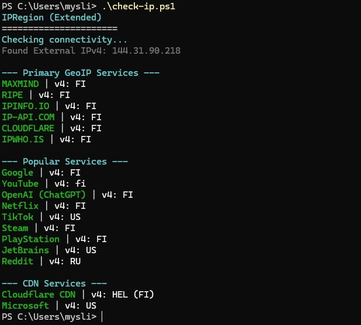

# IPRegion Windows (Extended Edition)



PowerShell-порт популярного скрипта [ipregion](https://github.com/vernette/ipregion/) для проверки доступности сервисов и определения геолокации IP-адреса.

Эта версия адаптирована для Windows и включает проверки для Steam, PSN, OpenAI, Netflix и др.

## Возможности
- 🚀 **Windows Native**: Не требует Docker или WSL. Работает на PowerShell 5.1 / Core 7+.
- 🌍 **IPv4 и IPv6**: Одновременная проверка обоих стеков.
- 🎮 **Gaming**: Steam, PlayStation Network.
- 🤖 **Tech**: OpenAI (ChatGPT), GitHub, JetBrains.
- 📊 **CDN**: Определение PoP Cloudflare и Microsoft.

## Установка и использование

### Быстрый запуск
1. Скачайте файл [`ipcheck.ps1`](ipcheck.ps1).
2. Кликните правой кнопкой мыши → **"Выполнить с помощью PowerShell"**.

### Запуск через терминал
```powershell
# Запустить проверку
.\ipcheck.ps1

# Показать только IPv4
.\ipcheck.ps1 -IPv4Only

# Вывод в формате JSON
.\ipcheck.ps1 -JsonOutput

# Проверить только игровые и стриминговые сервисы
.\ipcheck.ps1 -Groups custom
```

**Примечание**: Если скрипт не запускается из-за политики выполнения, разрешите её для текущего пользователя:
```powershell
Set-ExecutionPolicy -ExecutionPolicy RemoteSigned -Scope CurrentUser
```

## Параметры

- `-Groups <string>`: Выбор группы проверок (`all`, `primary`, `custom`, `cdn`)
- `-IPv4Only`: Проверять только IPv4
- `-IPv6Only`: Проверять только IPv6
- `-JsonOutput`: Вывод результатов в формате JSON
- `-VerboseLog`: Включить подробное логирование

## Лицензия
MIT